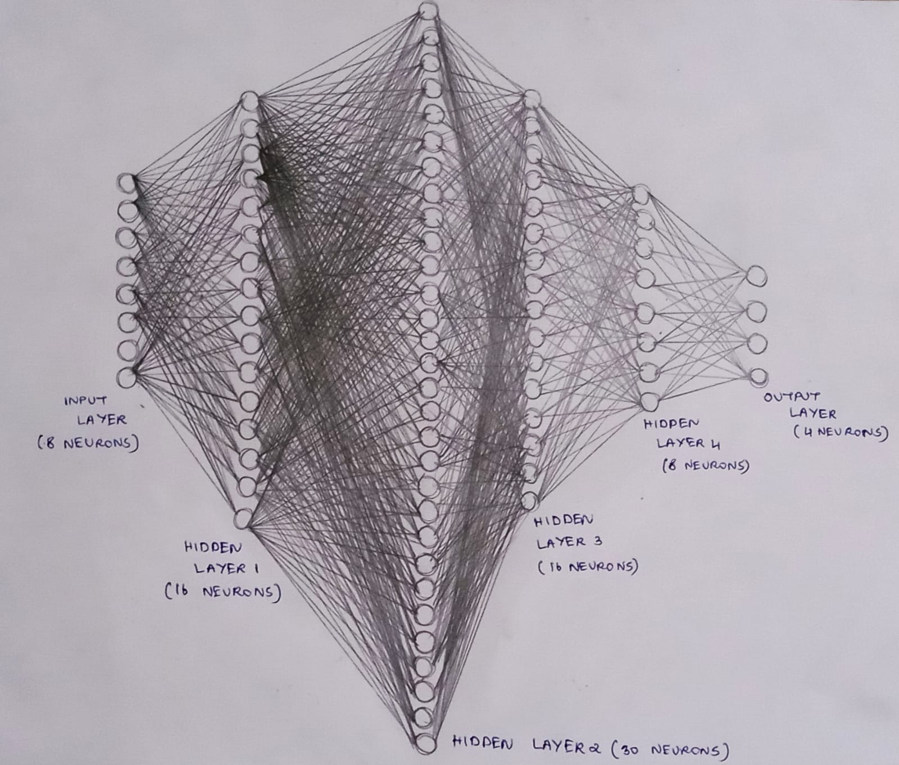
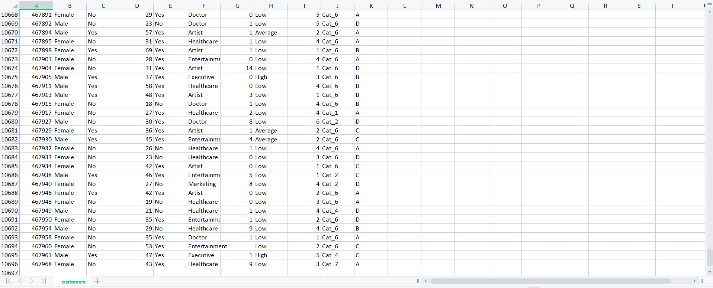
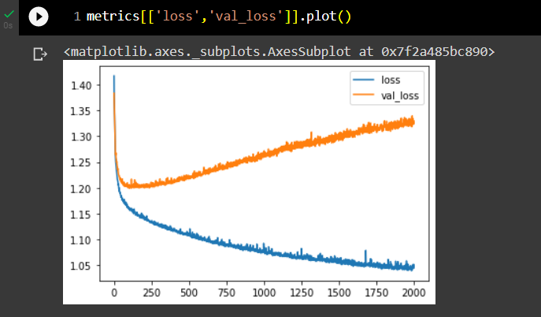
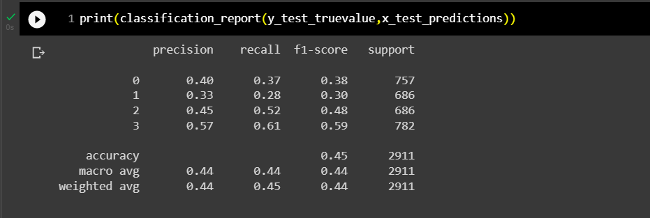
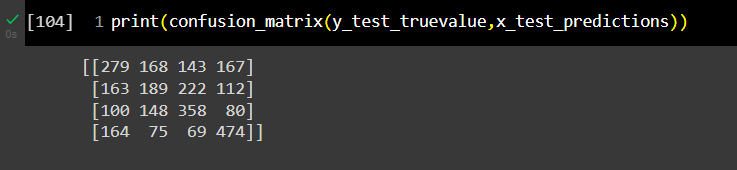
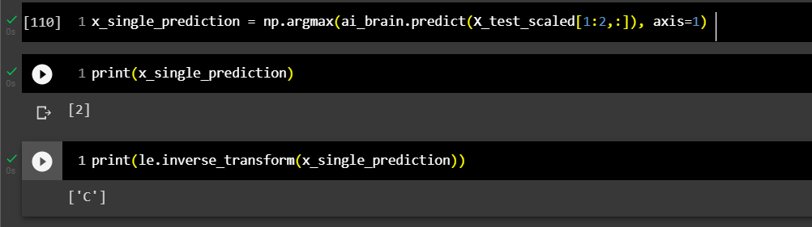

# DEVELOPING A NEURAL NETWORK CLASSIFICATION MODEL...

## AIM:

To develop a neural network classification model for the given dataset.

## PROBLEM STATEMENT:

An automobile company has plans to enter new markets with their existing products. After intensive market research, they’ve decided that the behavior of the new market is similar to their existing market.

In their existing market, the sales team has classified all customers into 4 segments (A, B, C, D ). Then, they performed segmented outreach and communication for a different segment of customers. This strategy has work exceptionally well for them. They plan to use the same strategy for the new markets.

You are required to help the manager to predict the right group of the new customers.

## NEURAL NETWORK MODEL:



## DESIGN STEPS:

### STEP 1:
Loading the given dataset to predict the right group of the new customers.

### STEP 2:
Checking for any null values in the dataset and simultaneously converting any variabales from string datatype to integer or float datatype using label encoder.

### STEP 3:
Spliting the dataset into training and testing ( 67 % training and 33 % testing ).

### STEP 4:
Create MinMaxScalar objects and fit the model from training and testing and transform the data to required form.

### STEP 5:
Build a Neural Network Model with some hidden layers and with four output neurons as there are 4 kinds of output variables ('A','B','C','D' ) which are converted to ( '0','1','2','3' ).After building the neural network model compile the next set of instructions to the model.

### STEP 6:
Train the model using the splitted dataset,(i.e) training data.

### STEP 7:
Plot the training loss (loss) and validation loss (val_loss).

### STEP 8:
Predicting the accuracy of the model through classification report and confusion matrix.

### STEP 9:
Predict the new sample data by saving the model,saving the data,loading the model and by loading the data and we obtain the right group of customers as '2' or 'C'.

### STEP 10:
End the program.

## PROGRAM:

```
### Developed by : Anto Richard.S,
### Reg.No : 212221240005,
### DEVELOPING A NEURAL NETWORK CLASSIFICATION MODEL...

import pandas as pd
from sklearn.model_selection import train_test_split
from tensorflow.keras.models import Sequential
from tensorflow.keras.models import load_model
import pickle
from tensorflow.keras.layers import Dense
from tensorflow.keras.layers import Dropout
from tensorflow.keras.layers import BatchNormalization
import tensorflow as tf
import seaborn as sns
from tensorflow.keras.callbacks import EarlyStopping
from sklearn.preprocessing import MinMaxScaler
from sklearn.preprocessing import LabelEncoder
from sklearn.preprocessing import OneHotEncoder
from sklearn.preprocessing import OrdinalEncoder
from sklearn.metrics import classification_report,confusion_matrix
import numpy as np
import matplotlib.pylab as plt

customer_df = pd.read_csv('customers.csv')

customer_df.columns

customer_df.dtypes

customer_df.shape

customer_df.isnull().sum()

customer_df_cleaned = customer_df.dropna(axis=0)

customer_df_cleaned.isnull().sum()

customer_df_cleaned.shape

customer_df_cleaned.dtypes

customer_df_cleaned['Gender'].unique()

customer_df_cleaned['Ever_Married'].unique()

customer_df_cleaned['Graduated'].unique()

customer_df_cleaned['Profession'].unique()

customer_df_cleaned['Spending_Score'].unique()

customer_df_cleaned['Var_1'].unique()

customer_df_cleaned['Segmentation'].unique()

categories_list=[['Male', 'Female'],
           ['No', 'Yes'],
           ['No', 'Yes'],
           ['Healthcare', 'Engineer', 'Lawyer', 'Artist', 'Doctor',
            'Homemaker', 'Entertainment', 'Marketing', 'Executive'],
           ['Low', 'Average', 'High']
           ]
enc = OrdinalEncoder(categories=categories_list)

customers_1 = customer_df_cleaned.copy()

customers_1[['Gender',
             'Ever_Married',
              'Graduated','Profession',
              'Spending_Score']] = enc.fit_transform(customers_1[['Gender',
                                                                 'Ever_Married',
                                                                 'Graduated','Profession',
                                                                 'Spending_Score']])

customers_1.dtypes

le = LabelEncoder()

customers_1['Segmentation'] = le.fit_transform(customers_1['Segmentation'])

customers_1.dtypes

customers_1 = customers_1.drop('ID',axis=1)
customers_1 = customers_1.drop('Var_1',axis=1)

customers_1.dtypes

# Calculate the correlation matrix
corr = customers_1.corr()

# Plot the heatmap
sns.heatmap(corr, 
        xticklabels=corr.columns,
        yticklabels=corr.columns,
        cmap="BuPu",
        annot= True)

sns.pairplot(customers_1)

sns.distplot(customers_1['Age'])

plt.figure(figsize=(10,6))
sns.countplot(customers_1['Family_Size'])

plt.figure(figsize=(10,6))
sns.boxplot(x='Family_Size',y='Age',data=customers_1)

plt.figure(figsize=(10,6))
sns.scatterplot(x='Family_Size',y='Spending_Score',data=customers_1)

plt.figure(figsize=(10,6))
sns.scatterplot(x='Family_Size',y='Age',data=customers_1)

customers_1.describe()

customers_1['Segmentation'].unique()

X=customers_1[['Gender','Ever_Married','Age','Graduated','Profession','Work_Experience','Spending_Score','Family_Size']].values

y1 = customers_1[['Segmentation']].values

one_hot_enc = OneHotEncoder()

one_hot_enc.fit(y1)

y1.shape

y = one_hot_enc.transform(y1).toarray()

y.shape

y1[0]

y[0]

X.shape

X_train,X_test,y_train,y_test=train_test_split(X,y,
                                               test_size=0.33,
                                               random_state=50)

X_train[0]

X_train.shape

scaler_age = MinMaxScaler()

scaler_age.fit(X_train[:,2].reshape(-1,1))

X_train_scaled = np.copy(X_train)
X_test_scaled = np.copy(X_test)

# To scale the Age column
X_train_scaled[:,2] = scaler_age.transform(X_train[:,2].reshape(-1,1)).reshape(-1)
X_test_scaled[:,2] = scaler_age.transform(X_test[:,2].reshape(-1,1)).reshape(-1)

# Creating the model
ai_brain = Sequential([
    Dense(8,input_shape=(8,)),
    Dense(16,activation='relu'),
    Dense(30,activation='relu'),
    Dense(16,activation='relu'),
    Dense(8,activation='relu'),
    Dense(4,activation='softmax')
 
])

ai_brain.compile(optimizer='adam',
                 loss='categorical_crossentropy',
                 metrics=['accuracy'])

early_stop = EarlyStopping(monitor='val_loss', patience=2)

ai_brain.fit(x=X_train_scaled,y=y_train,
             epochs=2000,batch_size=256,
             validation_data=(X_test_scaled,y_test),
             )

metrics = pd.DataFrame(ai_brain.history.history)

metrics.head()

metrics[['loss','val_loss']].plot()

# Sequential predict_classes function is deprecated
# predictions = ai_brain.predict_classes(X_test)
x_test_predictions = np.argmax(ai_brain.predict(X_test_scaled), axis=1)

x_test_predictions.shape

y_test_truevalue = np.argmax(y_test,axis=1)

y_test_truevalue.shape

print(confusion_matrix(y_test_truevalue,x_test_predictions))

print(classification_report(y_test_truevalue,x_test_predictions))

# Saving the Model
ai_brain.save('customer_classification_model.h5')

# Saving the data
with open('customer_data.pickle', 'wb') as fh:
   pickle.dump([X_train_scaled,y_train,X_test_scaled,y_test,customers_1,customer_df_cleaned,scaler_age,enc,one_hot_enc,le], fh)

# Loading the Model
ai_brain = load_model('customer_classification_model.h5')

# Loading the data
with open('customer_data.pickle', 'rb') as fh:
   [X_train_scaled,y_train,X_test_scaled,y_test,customers_1,customer_df_cleaned,scaler_age,enc,one_hot_enc,le]=pickle.load(fh)

x_single_prediction = np.argmax(ai_brain.predict(X_test_scaled[1:2,:]), axis=1)

print(x_single_prediction)

print(le.inverse_transform(x_single_prediction))

```

## DATASET INFORMATION:




## OUTPUT:

### TRAINING LOSS, VALIDATION LOSS Vs ITERATION PLOT:



### CLASSIFICATION REPORT:



### CONFUSION MATRIX:



### NEW SAMPLE DATA PREDICTION:



## RESULT:

Thus, a neural network classification model for predicting the right group of the new customers using the given dataset is developed using python programming.